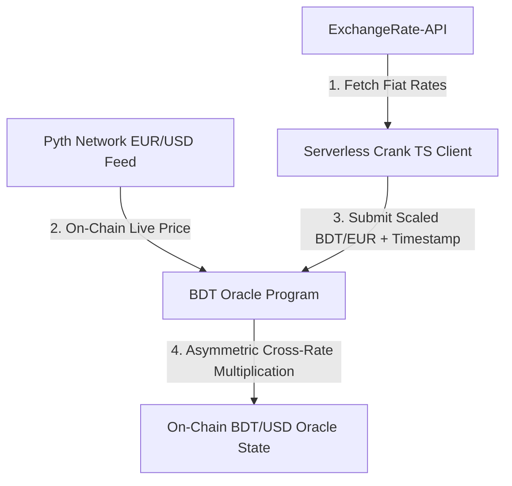

# 🧬 BDT Cross-Rate Oracle

[](https://explorer.solana.com/?cluster=devnet)
[](https://opensource.org/licenses/MIT)
[](https://www.typescriptlang.org/)
[](https://www.rust-lang.org/)

An enterprise-grade, high-efficiency Solana oracle program that synthesizes a real-time, fixed-point **BDT/USD (Bangladeshi Taka to US Dollar)** price feed. 

Since BDT is a low-liquidity fiat currency without direct, active on-chain Pyth or Chainlink feeds, this oracle utilizes an **Asymmetric Cross-Rate Engine**. It combines a low-frequency off-chain BDT/EUR fiat leg (updated via a serverless crank) with a high-frequency, live on-chain EUR/USD Pyth price feed to calculate a highly accurate BDT/USD rate on-chain.

---

## 📐 Architecture & Flow

The system runs on a hybrid execution model to achieve zero-cost on-chain storage with high price fidelity.



### Core Math (Fixed-Point Arithmetic)
The cross-rate calculation is processed on-chain using 128-bit precision to prevent overflow/underflow, then normalized down to 6 decimals:

$$\text{BDT/USD} = \text{BDT/EUR (Relayed, 9 Decimals)} \times \text{EUR/USD (Pyth, 8 Decimals)}$$

---

## 🚀 On-Chain Deployment (Devnet)

* **Program ID**: `4Xg8ntPZ8LE616Tqy4r18vBUuftombmb1jp15d6dqwAp`
* **BDT/USD Oracle Price Feed Account (Query this to get BDT Price)**: `CCW6UZ3uf2Y4XKc6XgE3A1Y9hn74AdzKjqoTZ9dk7vmj`

> [!IMPORTANT]  
> The **BDT/USD Oracle Price Feed Account** (`CCW6UZ3uf2Y4XKc6XgE3A1Y9hn74AdzKjqoTZ9dk7vmj`) is the public address that stores the live price data on-chain. This is the account that developers, dApps, and smart contracts must read/query to retrieve the current BDT rate.

---

## 🔒 Safety & Security Features

The oracle includes multiple robust validation checks to guarantee price feed integrity:

1. **Deviation Threshold Protection**: Rejects any update that deviates from the previous price by more than a specified percentage (default: `5%` / 500 bps), protecting downstream protocols from flash-crashes or manipulated inputs.
2. **Strict Chronological Sequence**: Rejects out-of-order timestamps (`relay_timestamp <= last_timestamp`), preventing replay attacks.
3. **Clock-Drift Tolerance**: Rejects future timestamps while allowing a safe `60-second` clock drift window to accommodate validator time drift.
4. **Staleness Bounds**: Rejects stale Pyth feed inputs in production environments (maximum age of 1 hour).

---

## 📊 Oracle State Account Layout

The state account occupies exactly **76 bytes** (including the 8-byte Anchor discriminator). All values are stored in **little-endian (LE)** format.

| Offset (Bytes) | Field Name | Type | Description |
| :--- | :--- | :--- | :--- |
| `0 - 8` | Anchor Discriminator | `[u8; 8]` | Auto-generated struct identifier |
| `8 - 40` | `crank_authority` | `Pubkey` | Authorized public key permitted to submit updates |
| `40 - 56` | `derived_bdt_usd_scaled` | `u128` | **Derived BDT/USD Price scaled to 6 decimals (1e6)** |
| `56 - 64` | `pyth_last_timestamp` | `i64` | Verified Pyth feed slot cluster time baseline |
| `64 - 72` | `relay_last_timestamp`| `i64` | Injected relayer UNIX clock tracking timestamp |
| `72 - 76` | `max_deviation_bps` | `u32` | Max allowed update deviation (in basis points) |

---

## 🛠️ Integration & Developer Guide

### 1. Consuming BDT/USD Price in TypeScript

Fetch and deserialize the oracle state using `@solana/web3.js` without any Anchor dependencies:

```typescript
import { Connection, PublicKey } from "@solana/web3.js";

// BDT/USD Feed Address on Devnet
const ORACLE_STATE_ADDRESS = new PublicKey("CCW6UZ3uf2Y4XKc6XgE3A1Y9hn74AdzKjqoTZ9dk7vmj");
const connection = new Connection("https://api.devnet.solana.com", "confirmed");

async function fetchBdtUsdPrice(): Promise<number> {
  const accountInfo = await connection.getAccountInfo(ORACLE_STATE_ADDRESS);
  if (!accountInfo) {
    throw new Error("Oracle state account not found");
  }

  // Parse derived_bdt_usd_scaled (u128 LE at offset 40)
  const priceBuffer = accountInfo.data.slice(40, 56);
  const low = priceBuffer.readBigUInt64LE(0);
  const high = priceBuffer.readBigUInt64LE(8);
  const priceScaled = low | (high << 64n);

  // Divide by 1e6 normalizer to get real BDT/USD price
  const price = Number(priceScaled) / 1_000_000;
  
  // Parse last update timestamp (offset 64)
  const lastUpdate = Number(accountInfo.data.readBigInt64LE(64));

  console.log(`BDT/USD Price: ${price} BDT (Last updated: ${new Date(lastUpdate * 1000).toLocaleString()})`);
  return price;
}

fetchBdtUsdPrice().catch(console.error);
```

### 2. Consuming BDT/USD Price in a Solana Program (Rust)

#### Struct Definition
```rust
use anchor_lang::prelude::*;

#[account]
pub struct BdtOracleAccount {
    pub crank_authority: Pubkey,
    pub derived_bdt_usd_scaled: u128,  // Target output normalization: 1e6 (6 decimals)
    pub pyth_last_timestamp: i64,
    pub relay_last_timestamp: i64,
    pub max_deviation_bps: u32,
}
```

#### Consumer Handler
```rust
use anchor_lang::prelude::*;
use crate::BdtOracleAccount;

#[derive(Accounts)]
pub struct ConsumePrice<'info> {
    /// CHECK: Inspected in instruction handler
    pub bdt_oracle: Account<'info, BdtOracleAccount>,
}

pub fn handle_consume_price(ctx: Context<ConsumePrice>) -> Result<()> {
    let oracle = &ctx.accounts.bdt_oracle;
    
    // Retrieve the scaled BDT/USD price (6 decimals)
    let scaled_price: u128 = oracle.derived_bdt_usd_scaled;
    
    // Enforce freshness (e.g., maximum age 1 hour)
    let current_time = Clock::get()?.unix_timestamp;
    require!(
        current_time - oracle.relay_last_timestamp <= 3600,
        ErrorCode::StalePriceFeed
    );

    msg!("Current BDT/USD Price: {}.{:06}", scaled_price / 1_000_000, scaled_price % 1_000_000);
    Ok(())
}

#[error_code]
pub enum ErrorCode {
    #[msg("The BDT/USD price feed is stale.")]
    StalePriceFeed,
}
```

---

## ⚙️ Local Setup & Configuration

### Prerequisites
*   Node.js 18+ & npm
*   Rust & Cargo
*   Solana CLI Tools
*   Anchor CLI (v0.30+)

### 1. Environment Variables (`.env`)
Create a `.env` file in the root directory:
```env
RPC_URL=https://api.devnet.solana.com
CRANK_PRIVATE_KEY=your_base58_encoded_authority_private_key
PROGRAM_ID=4Xg8ntPZ8LE616Tqy4r18vBUuftombmb1jp15d6dqwAp
EXCHANGE_RATE_API_KEY=your_exchangerate_api_key
```

### 2. Install Dependencies
```bash
npm install
```

### 3. Run Tests
Runs the test suite using a local validator loaded with a Pyth EUR/USD feed fixture:
```bash
anchor test
```

### 4. Run the Crank Client Manual Update
Runs the TypeScript client to fetch the latest rates and submit them to Devnet:
```bash
npm run crank
```

---

## ⏰ Automated Oracle Updates (GitHub Actions Crank)

To maintain a fresh on-chain price feed, this repository includes an automated GitHub Actions cron workflow (`.github/workflows/crank.yml`):
* **Execution Schedule**: Automatically triggers **every hour** (`0 * * * *`).
* **Self-Termination Safety**: Configured with a `timeout-minutes: 5` limit. If the RPC connection hangs, the job automatically terminates/kills itself to avoid wasting GitHub Action runner minutes.
* **Secrets Required**: Make sure to add `SOLANA_RPC_URL`, `CRANK_PRIVATE_KEY`, and `EXCHANGE_RATE_API_KEY` to your GitHub Repository Secrets.

---

## 📄 License

This project is open-source and available under the terms of the [MIT License](LICENSE).
